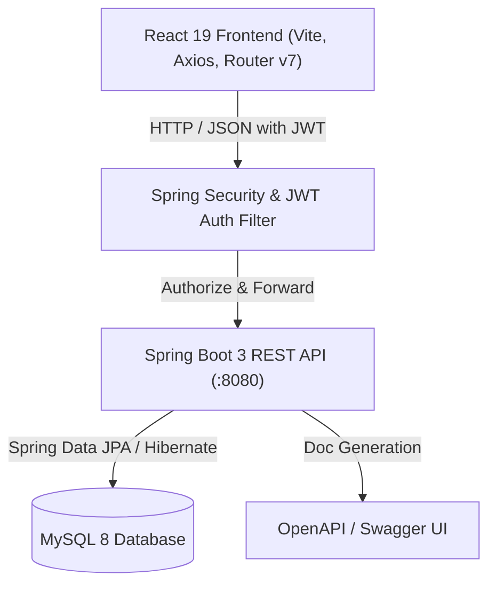

# 🌱 Plant Care Scheduler

[](https://spring.io/projects/spring-boot)
[](https://react.dev/)
[](https://vitejs.dev/)
[](https://www.oracle.com/java/)
[](https://www.mysql.com/)
[](https://jwt.io/)
[](http://localhost:8080/swagger-ui.html)
[](LICENSE)

An intelligent, full-stack plant care scheduling and botanical health tracking platform. **Plant Care Scheduler** empowers plant enthusiasts, urban gardeners, and botanical specialists to track watering/fertilization routines, log environmental telemetry, monitor plant health histories, seek expert consultations, and connect with a thriving plant community.

---

## 📑 Table of Contents

- [Key Features](#-key-features)
- [System Architecture](#-system-architecture)
- [Tech Stack](#-tech-stack)
- [Project Directory Structure](#-project-directory-structure)
- [Database & Data Models](#-database--data-models)
- [API Endpoints Reference](#-api-endpoints-reference)
- [Getting Started & Local Setup](#-getting-started--local-setup)
  - [Prerequisites](#prerequisites)
  - [1. Database Configuration](#1-database-configuration)
  - [2. Backend Setup (Spring Boot)](#2-backend-setup-spring-boot)
  - [3. Frontend Setup (React + Vite)](#3-frontend-setup-react--vite)
- [Environment Variables](#-environment-variables)
- [User Roles & Permissions](#-user-roles--permissions)
- [Documentation & Reports](#-documentation--reports)
- [License](#-license)

---

## ✨ Key Features

### 🌿 1. Plant Inventory & Asset Tracking
- Manage individual plant profiles with custom nicknames, indoor/outdoor locations, pot sizes, and soil types.
- Record growth metrics (height, width in cm) and track lifecycle acquisition dates.
- Real-time plant health statuses (`EXCELLENT`, `HEALTHY`, `NEEDS_ATTENTION`, `SICK`).

### 📖 2. Botanical Species Catalog
- Searchable species encyclopedia with scientific nomenclature, common names, and family classification.
- Detailed care baselines: watering frequency, sunlight levels, ambient humidity %, optimal temperature bounds, and toxicity warnings.

### ⏰ 3. Care Task Automation & Calendar
- Automatic and custom care schedules for **Watering**, **Fertilizing**, **Repotting**, **Pruning**, and **Misting**.
- Priority labeling (`HIGH`, `MEDIUM`, `LOW`), overdue indicators, and one-click task completion logs.

### 🩺 4. Plant Health Records & Diagnostics
- Log symptom timelines, pest infestations, root rot, fungal infections, and recovery milestones.
- Track treatments applied, prognosis notes, and recovery status histories.

### 🌡️ 5. Environmental Telemetry & Microclimate Logs
- Record environmental conditions by room/location: Temperature (°C/°F), Humidity (%), Light Exposure (Lux/levels), and Soil Moisture.
- Historical logging to detect adverse climate conditions before plants show stress.

### 💬 6. Community Forum & Discussion
- Share plant care milestones, photos, and gardening questions.
- Nested commenting system for peer advice and knowledge exchange.

### 🧑‍🌾 7. Expert Botanical Consultations
- Book appointment sessions with plant specialists and agronomists.
- Track consultation lifecycle (`PENDING`, `SCHEDULED`, `COMPLETED`, `CANCELLED`) with diagnostic feedback and tailored recommendations.

### 🔔 8. Real-time Notifications & Reminders
- Instant reminders for overdue care tasks, upcoming consultation updates, and community replies.

---

## 🏛️ System Architecture



---

## 💻 Tech Stack

### Backend
- **Framework:** Spring Boot 3.5.x
- **Language:** Java 17
- **Security:** Spring Security 6 with stateless JWT (`io.jsonwebtoken` JJWT 0.12.6) & BCrypt
- **Persistence:** Spring Data JPA (Hibernate ORM)
- **Validation:** Hibernate Validator (`jakarta.validation`)
- **API Documentation:** SpringDoc OpenAPI 3 / Swagger UI (`springdoc-openapi-starter-webmvc-ui:2.8.9`)
- **Utilities:** Project Lombok, Spring Dotenv (`me.paulschwarz:spring-dotenv`)
- **Build Tool:** Apache Maven

### Frontend
- **Framework:** React 19
- **Build Tool / Bundler:** Vite 8
- **Routing:** React Router v7 (`react-router-dom`)
- **HTTP Client:** Axios (configured with base URL and JWT token headers)
- **Styling:** Modern Vanilla CSS (Glassmorphism, CSS Variables, Responsive Grid/Flexbox layouts, Accent Themes)

### Database
- **Engine:** MySQL 8.x
- **Driver:** MySQL Connector/J

---

## 📂 Project Directory Structure

```text
plantcarescheduler/
├── .env.example                          # Environment variables template (copy to .env)
├── pom.xml                               # Maven build configuration & backend dependencies
├── README.md                             # Project documentation
├── Diagram&Report/                       # Software engineering documentation & diagrams
│   ├── ER-Diagram PlantCareScheduler.png # Entity Relationship diagram
│   ├── UML-DIAGRAM10ENTITES.drawio.png   # Complete UML diagram
│   ├── PlantCareScheduler-SRS.pdf        # Software Requirements Specification (SRS)
│   └── PlantCareScheduler-Project-Report.pdf
├── src/main/java/com/suchitra/plantcarescheduler/
│   ├── PlantcareschedulerApplication.java # Spring Boot main entry point
│   ├── config/                           # CORS & Application configurations
│   ├── controller/                       # REST API Controllers (11 controllers)
│   │   ├── AuthenticationController.java
│   │   ├── CareTaskController.java
│   │   ├── CommentController.java
│   │   ├── CommunityPostController.java
│   │   ├── ConsultationController.java
│   │   ├── EnvironmentDataController.java
│   │   ├── HealthRecordController.java
│   │   ├── NotificationController.java
│   │   ├── PlantController.java
│   │   ├── SpeciesController.java
│   │   └── UserController.java
│   ├── dto/                              # Request & Response Data Transfer Objects
│   ├── entity/                           # JPA Data Entities (10 core entities + Role enum)
│   ├── mapper/                           # Entity-DTO conversion mappers
│   ├── repository/                       # Spring Data JPA Repositories
│   ├── security/                         # JWT filters, UserDetails, SecurityConfig
│   ├── service/                          # Business logic service layer & implementations
│   └── util/                             # Helper classes and utilities
├── src/main/resources/
│   └── application.properties            # Spring Boot application properties
└── reactapp/                             # Frontend React Application
    ├── package.json                      # Node dependencies and scripts
    ├── vite.config.js                    # Vite configuration
    ├── index.html                        # HTML root
    └── src/
        ├── App.jsx                       # Main application router
        ├── index.css                     # Global design tokens and theme variables
        ├── components/                   # Reusable UI components
        │   ├── Navbar.jsx                # Navigation bar with active route highlight & notifications
        │   ├── ProtectedRoute.jsx        # JWT-guarded route wrapper
        │   ├── Layout.jsx                # App layout shell
        │   └── EditProfileModal.jsx      # Modal for updating profile info
        ├── pages/                        # Page views
        │   ├── Landing.jsx               # Hero landing presentation
        │   ├── Login.jsx                 # User login screen
        │   ├── Register.jsx              # User registration screen
        │   ├── Dashboard.jsx             # Analytics dashboard & quick actions
        │   ├── Plants.jsx                # Plant collection manager
        │   ├── Species.jsx               # Botanical encyclopedia
        │   ├── Tasks.jsx                 # Care scheduler & task timeline
        │   ├── HealthRecords.jsx         # Health logs & diagnostic cards
        │   ├── Environment.jsx           # Microclimate sensor logs
        │   ├── Community.jsx             # Community posts & comments
        │   ├── Consultations.jsx         # Specialist booking & records
        │   ├── Notifications.jsx         # Real-time alert center
        │   └── Profile.jsx               # User profile & account overview
        └── services/                     # Axios API service clients
            ├── api.js                    # Base Axios instance
            ├── authService.js
            ├── plantService.js
            ├── speciesService.js
            ├── taskService.js
            ├── healthRecordService.js
            ├── environmentService.js
            ├── communityService.js
            ├── consultationService.js
            ├── notificationService.js
            └── userService.js
```

---

## 🗄️ Database & Data Models

The system consists of **10 interconnected entities**:

| Entity | Description | Key Relationships |
| :--- | :--- | :--- |
| **`User`** | System user, specialist, or administrator | 1-to-Many with `Plant`, `CommunityPost`, `Comment`, `Consultation`, `Notification` |
| **`Species`** | Botanical species taxonomy & care guide | 1-to-Many with `Plant` |
| **`Plant`** | Individual plant owned by a user | Belongs to `User` & `Species`; 1-to-Many with `CareTask`, `HealthRecord`, `EnvironmentData` |
| **`CareTask`** | Scheduled care operation (Water, Fertilize, etc.) | Belongs to `Plant`, optionally completed by `User` |
| **`HealthRecord`** | Diagnostic log, pest tracking, and treatments | Belongs to `Plant` |
| **`EnvironmentData`** | Sensor readings (Temp, Humidity, Light, Soil) | Belongs to `Plant` |
| **`CommunityPost`** | User-generated forum post | Belongs to `User`; 1-to-Many with `Comment` |
| **`Comment`** | Discussion responses on community posts | Belongs to `CommunityPost` & `User` |
| **`Consultation`** | Specialist appointment and care advice | Belongs to Client `User` & Specialist `User` |
| **`Notification`** | User alerts for tasks and system activities | Belongs to `User` |

---

## 🔌 API Endpoints Reference

### 🔐 Authentication (`/api/auth`)
| Method | Endpoint | Description | Access |
| :--- | :--- | :--- | :--- |
| `POST` | `/api/auth/register` | Register a new user | Public |
| `POST` | `/api/auth/login` | Authenticate and obtain JWT token | Public |
| `GET` | `/api/auth/me` | Retrieve currently authenticated user profile | Authenticated |
| `PUT` | `/api/auth/me` | Update current user profile details | Authenticated |

### 🌿 Plants (`/api/plants`)
| Method | Endpoint | Description | Access |
| :--- | :--- | :--- | :--- |
| `GET` | `/api/plants` | Get all plants (filtered by owner or admin) | Authenticated |
| `GET` | `/api/plants/{id}` | Get specific plant details | Authenticated |
| `POST` | `/api/plants` | Add a new plant to user collection | Authenticated |
| `PUT` | `/api/plants/{id}` | Update plant information | Authenticated |
| `DELETE` | `/api/plants/{id}` | Remove plant from collection | Authenticated |

### 📖 Species (`/api/species`)
| Method | Endpoint | Description | Access |
| :--- | :--- | :--- | :--- |
| `GET` | `/api/species` | List all botanical species | Authenticated |
| `GET` | `/api/species/{id}` | Get species care guide by ID | Authenticated |
| `POST` | `/api/species` | Add new species to catalog | Authenticated |
| `PUT` | `/api/species/{id}` | Update species care parameters | Authenticated |
| `DELETE` | `/api/species/{id}` | Delete a species | Authenticated |

### ⏰ Care Tasks (`/api/tasks`)
| Method | Endpoint | Description | Access |
| :--- | :--- | :--- | :--- |
| `GET` | `/api/tasks` | Get all scheduled tasks | Authenticated |
| `GET` | `/api/tasks/{id}` | Get task by ID | Authenticated |
| `GET` | `/api/tasks/plant/{plantId}` | Get care tasks for a specific plant | Authenticated |
| `POST` | `/api/tasks` | Create a new care task | Authenticated |
| `PUT` | `/api/tasks/{id}` | Edit care task details | Authenticated |
| `PATCH` | `/api/tasks/{id}/complete` | Mark care task as completed | Authenticated |
| `DELETE` | `/api/tasks/{id}` | Delete a care task | Authenticated |

### 🩺 Health Records (`/api/health-records`)
| Method | Endpoint | Description | Access |
| :--- | :--- | :--- | :--- |
| `GET` | `/api/health-records` | Get all health records | Authenticated |
| `GET` | `/api/health-records/plant/{plantId}`| Get health logs for a specific plant | Authenticated |
| `POST` | `/api/health-records` | Log new health condition / treatment | Authenticated |
| `PUT` | `/api/health-records/{id}` | Update health record | Authenticated |
| `DELETE` | `/api/health-records/{id}` | Delete health record | Authenticated |

### 🌡️ Environment Telemetry (`/api/environment-data`)
| Method | Endpoint | Description | Access |
| :--- | :--- | :--- | :--- |
| `GET` | `/api/environment-data` | Get all microclimate logs | Authenticated |
| `GET` | `/api/environment-data/plant/{plantId}`| Get sensor logs for a specific plant | Authenticated |
| `POST` | `/api/environment-data` | Record environment telemetry data | Authenticated |
| `PUT` | `/api/environment-data/{id}` | Update environment log | Authenticated |
| `DELETE` | `/api/environment-data/{id}` | Delete environment log | Authenticated |

### 💬 Community & Forum (`/api/community-posts` & `/api/comments`)
| Method | Endpoint | Description | Access |
| :--- | :--- | :--- | :--- |
| `GET` | `/api/community-posts` | List all community posts | Authenticated |
| `POST` | `/api/community-posts` | Publish a new discussion post | Authenticated |
| `GET` | `/api/community-posts/{id}` | Get post details and comments | Authenticated |
| `POST` | `/api/comments` | Post a reply/comment to a discussion | Authenticated |

### 🧑‍🌾 Consultations (`/api/consultations`)
| Method | Endpoint | Description | Access |
| :--- | :--- | :--- | :--- |
| `GET` | `/api/consultations` | Get all consultation requests | Authenticated |
| `POST` | `/api/consultations` | Request a new specialist consultation | Authenticated |
| `GET` | `/api/consultations/user/{userId}` | Get consultations requested by a user | Authenticated |
| `GET` | `/api/consultations/specialist/{id}` | Get specialist assigned consultations | Authenticated |
| `PUT` | `/api/consultations/{id}` | Update consultation notes / status | Authenticated |
| `DELETE` | `/api/consultations/{id}` | Cancel/delete consultation | Authenticated |

### 🔔 Notifications (`/api/notifications`)
| Method | Endpoint | Description | Access |
| :--- | :--- | :--- | :--- |
| `GET` | `/api/notifications/user/{userId}` | Get user notification feed | Authenticated |
| `PATCH` | `/api/notifications/{id}/read` | Mark notification as read | Authenticated |
| `DELETE` | `/api/notifications/{id}` | Dismiss notification | Authenticated |

> 📚 **Interactive Swagger API Documentation:**
> When the backend server is running, visit **`http://localhost:8080/swagger-ui.html`** or **`http://localhost:8080/swagger-ui/index.html`** for full interactive API testing.

---

## 🚀 Getting Started & Local Setup

### Prerequisites
Make sure you have the following installed on your machine:
- **Java Development Kit (JDK):** Version 17 or higher (`java -version`)
- **Maven:** Version 3.8+ (or use the included `./mvnw` wrapper)
- **Node.js:** Version 18.x or higher (`node -v`)
- **MySQL Database Server:** Version 8.0+

---

### 1. Database Configuration
Open your MySQL CLI or GUI tool (MySQL Workbench / DBeaver) and create the database schema:

```sql
CREATE DATABASE plantcare_db;
```

---

### 2. Backend Setup (Spring Boot)

1. Create your local `.env` file from the provided template:
   ```bash
   cp .env.example .env
   ```
   *Or manually copy `.env.example` to `.env` and fill in your local database credentials:*
   ```env
   # Database Configuration
   DB_URL=jdbc:mysql://localhost:3306/plantcare_db?useSSL=false&serverTimezone=UTC&allowPublicKeyRetrieval=true
   DB_USERNAME=root
   DB_PASSWORD=your_mysql_password

   # Server Port
   SERVER_PORT=8080

   # JWT Security Key (minimum 256-bit secret) & Expiration (24 hours)
   JWT_SECRET=your_custom_jwt_secret_key_minimum_256_bits_here
   JWT_EXPIRATION=86400000
   ```

2. Build and run the Spring Boot backend:
   ```bash
   # On Windows (PowerShell / Command Prompt)
   .\mvnw.cmd spring-boot:run

   # On macOS / Linux
   ./mvnw spring-boot:run
   ```
   *The backend will boot up at `http://localhost:8080`.*

---

### 3. Frontend Setup (React + Vite)

1. Navigate to the `reactapp` directory:
   ```bash
   cd reactapp
   ```

2. Install all frontend dependencies:
   ```bash
   npm install
   ```

3. Start the Vite development server:
   ```bash
   npm run dev
   ```
   *The frontend client will start at `http://localhost:5173`.*

4. Open your web browser and navigate to:
   ```
   http://localhost:5173
   ```

---

## ⚙️ Environment Variables

The application utilizes environment variables loaded dynamically via `spring-dotenv`:

| Variable | Description | Default / Example Value |
| :--- | :--- | :--- |
| `DB_URL` | JDBC MySQL connection URL | `jdbc:mysql://localhost:3306/plantcare_db` |
| `DB_USERNAME` | MySQL database username | `root` |
| `DB_PASSWORD` | MySQL database user password | `password` |
| `SERVER_PORT` | Port on which the Spring Boot server runs | `8080` |
| `JWT_SECRET` | Secret HMAC key for signing JWT tokens | `plantcare_scheduler_secret_key_...` |
| `JWT_EXPIRATION` | Token validity duration in milliseconds | `86400000` *(24 Hours)* |

---

## 👥 User Roles & Permissions

The application supports three role tiers defined in `Role.java`:

- 👤 **`ROLE_USER`**: Regular plant owner. Can manage personal plants, complete care tasks, record health & environment metrics, request consultations, and participate in community discussions.
- 🧑‍🌾 **`ROLE_SPECIALIST`**: Botanical specialist / agronomist. Has access to assigned consultation sessions, diagnostic logs, and specialist review panels.
- 🛡️ **`ROLE_ADMIN`**: System administrator. Has full oversight across all user profiles, species catalog, system plants, and database moderation.

---

## 📑 Documentation & Reports

Check the `Diagram&Report/` folder for comprehensive project documentation:
- 📊 **`ER-Diagram PlantCareScheduler.png`**: Complete Entity-Relationship schema diagram.
- 📐 **`UML-DIAGRAM10ENTITES.drawio.png`**: Class diagrams showing relationships, cardinalities, and methods.
- 📄 **`PlantCareScheduler-SRS.pdf`**: Software Requirements Specification with functional & non-functional requirements.
- 📑 **`PlantCareScheduler-Project-Report.pdf`**: Comprehensive academic project report.
- 📽️ **`Plant-Care-Scheduler.pptx`**: Project presentation slide deck.

---

## 📄 License

This project is open-source and licensed under the [MIT License](LICENSE).
